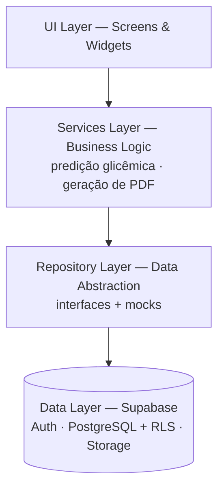

# Diabetter

> Aplicação multiplataforma para registro, visualização e predição de dados glicêmicos — voltada ao contexto brasileiro de automonitoramento manual do diabetes.

📄 **Paper:** [Diabetter-v2.pdf](Diabetter-v2.pdf) ·
🌐 **App:** <https://diabetter-p1.vercel.app/> ·
🎬 **Demo:** <http://tiny.cc/diabetter>

Repositório que acompanha a submissão do artigo *"Diabetter: A Cross-Platform Application for Glycemic Tracking and Visualization"* (UFCG).

---

## 🎥 Vídeo de apresentação

> _Em breve._ O vídeo de apresentação do trabalho será disponibilizado em `docs/media/demo.mp4` e/ou linkado a partir desta seção.

---

## Sobre o trabalho

O diabetes mellitus afeta mais de 20 milhões de brasileiros e impacta significativamente o sistema de saúde e a vida dos pacientes. Apesar do avanço da digitalização em saúde, soluções acessíveis e integradas para o autocuidado ainda são escassas: muitos pacientes seguem dependendo de cadernetas em papel para registrar glicemia, insulina e eventos relacionados, o que leva à perda de dados e à baixa adesão. Monitores contínuos de glicose (CGM) são caros e pouco acessíveis no SUS, e os principais aplicativos disponíveis (MySugr, GlucoseBuddy) restringem funcionalidades-chave — como exportação de relatórios em PDF — a planos pagos e não oferecem interface em português.

**Diabetter** é um MVP multiplataforma (Flutter + Supabase) projetado para apoiar o automonitoramento de pessoas com diabetes que dependem de entrada manual de dados. O sistema oferece registro de glicemia e insulina, gráficos de tendência interativos, predição glicêmica via média móvel ponderada, notificações personalizadas e exportação de relatórios em PDF — com isolamento estrito de dados via Row-Level Security no banco e funcionalidades essenciais disponíveis no plano gratuito.

---

## ⚠️ Aviso médico

> **Diabetter é uma ferramenta informacional de apoio ao automonitoramento e NÃO substitui orientação, diagnóstico ou tratamento médico.** As predições glicêmicas são projeções estatísticas (média móvel ponderada sobre as últimas 24h) e **não devem ser usadas para decisões clínicas**. Em emergências, ligue **192 (SAMU)**. Consulte os [Termos de Uso](TERMOS_DE_USO.md).

---

## Autores

**Universidade Federal de Campina Grande (UFCG)** — Campina Grande/PB, Brasil

- André de Figueirêdo C. Cunha — `andre.figueiredo.castro.cunha@ccc.ufcg.edu.br`
- Ana Cecília de O. Farias — `ana.cecilia.farias.oliveira@ccc.ufcg.edu.br`
- Ana Virgínia de S. Nery — `ana.virginia.souza.nery@ccc.ufcg.edu.br`
- Gabriela Virginia M. Mendes — `gabriela.virginia.melo.mendes@ccc.ufcg.edu.br`
- Guilherme D. Boia de Albuquerque - `guilherme.dantas.boia.albuquerque@ccc.ufcg.edu.br`
- Carlos Eduardo S. Pires — `cesp@dsc.ufcg.edu.br`

---

## Arquitetura

O sistema adota uma arquitetura cliente-servidor em quatro camadas, construída inteiramente sobre tecnologias open-source, com Repository Pattern e injeção de dependência via singleton `AppConfig`. Implementações *mock* dos repositórios permitem executar a aplicação completa sem backend, facilitando testes e demonstração.



- **Frontend:** Flutter — Android, iOS, Web (PWA), Linux, macOS, Windows
- **Backend:** Supabase — PostgreSQL com Row-Level Security, autenticação via JWT, Edge Functions e `pg_cron` para notificações por email
- **Sem servidor de aplicação dedicado** — toda regra de acesso vive no banco, reduzindo custo operacional e superfície de ataque

---

## Funcionalidades

- **Onboarding clínico** — unidade glicêmica (mg/dL ou mmol/L), metas, tipo de tratamento e horários de notificação. Aviso médico obrigatório antes do acesso. (`lib/screens/onboarding_screen.dart`)
- **Registro de glicemia, insulina e eventos** — validação clínica (glicemia entre 40-600 mg/dL); contagem de quota mensal via RPC PostgreSQL atômica. (`lib/screens/record_screen.dart`)
- **Gráficos e estatísticas** — séries de 7, 14 ou 30 dias, *time-in-range* (70-180 mg/dL), médias, mínimos e máximos, renderizados via `CustomPainter`. (`lib/screens/charts_screen.dart`)
- **Predição de tendência** — média móvel ponderada sobre as últimas 24h, classificação em cinco níveis (subida rápida, subida lenta, estável, queda lenta, queda rápida) e *confidence score* baseado no desvio padrão e na recência das medições. (`lib/services/predictions_service.dart`)
- **Exportação em PDF** — relatórios de 7, 14, 30 ou 45 dias, com compilação condicional para web e mobile e compartilhamento via `share_plus`. (`lib/services/export_service*.dart`)
- **Notificações por email** — Edge Function agendada por `pg_cron`. (`supabase/functions/send_email_notifications`)
- **Isolamento estrito de dados** — políticas RLS por usuário em todas as tabelas, tráfego HTTPS, autenticação por JWT. (`supabase/rls_policies.sql`)
- **Multiplataforma** — builds para Android, iOS, Web (PWA), Linux, macOS e Windows a partir de uma única base de código.
- **Modelo freemium acessível** — 30 registros/mês e 2 exportações de PDF gratuitos, *sem paywall em features clínicas core*.

---

## Estrutura do repositório

```
lib/         · código Flutter (screens, services, repositories, models)
supabase/    · schema SQL, políticas RLS, triggers, cron, Edge Functions
test/        · testes de repositórios e serviços
docs/        · documentação técnica (setup, mídia)
```

---

## Reprodutibilidade

Para revisores e desenvolvedores que queiram executar o projeto localmente, ver **[docs/SETUP.md](docs/SETUP.md)**.

Artefatos de backend disponíveis para inspeção:

- `supabase/schema.sql` — esquema do banco
- `supabase/rls_policies.sql` — políticas de isolamento por usuário
- `supabase/triggers.sql`, `supabase/cron_notifications.sql` — lógica em banco
- `supabase/functions/send_email_notifications/` — Edge Function de notificação

---

## Privacidade e termos

- [Política de Privacidade](POLITICA_DE_PRIVACIDADE.md) — conformidade com a LGPD
- [Termos de Uso](TERMOS_DE_USO.md) — limitações de responsabilidade

---

## Licença

Uso restrito. Para uso acadêmico ou licenciamento, contatar os autores.
